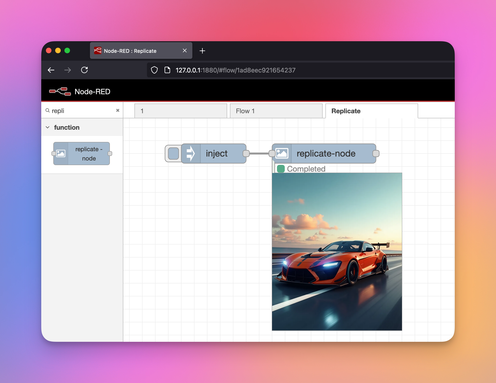

# node-red-contrib-replicate



A Node-RED node for generating images using the Replicate API. This node supports various Replicate models, including standard base models and LoRA fine-tuned models.

## Prerequisites

- Node-RED installation
- Replicate API key (get one at [replicate.com](https://replicate.com))

## Installation

### Manual Installation

1. **Download the Code**:
   - Clone the repository or download the ZIP file from GitHub.

   ```
   git clone https://github.com/ashakoen/node-red-contrib-replicate.git
   ```

2. **Navigate to the Node-RED User Directory**:
   - Typically, this is located at `~/.node-red`.

   ```
   cd ~/.node-red
   ```

3. **Copy the Node Files**:
   - Copy the downloaded files into the `~/.node-red` directory.

4. **Install Dependencies**:
   - Run the following command to install the necessary dependencies.

   ```
   npm install ./node-red-contrib-replicate
   ```

5. **Restart Node-RED**:
   - Restart your Node-RED instance to load the new node.

## Features

- Support for standard Replicate models and LoRA fine-tuned models
- Automatic parameter validation and adjustment
- Supports image inputs via URL, file path, or base64 data
- Comprehensive error handling and status feedback
- Configurable output formats (webp, jpg, png)
- Support for various model-specific parameters

## Usage

1. Add your Replicate API key in a configuration node.
2. Choose your model type (Standard or LoRA).
3. Configure model-specific parameters.
4. Send input via msg.payload.

### Input Parameters

The node accepts parameters via the node configuration or ```msg.payload```. Parameters in ```msg.payload``` override node configuration.

Common parameters include:
- ```prompt``` - Text description of the desired image
- ```num_outputs``` - Number of images to generate (1-4)
- ```num_inference_steps``` - Number of denoising steps
- ```guidance_scale``` - How closely to follow the prompt (0-10)
- ```aspect_ratio``` - Image aspect ratio (e.g., "1:1", "16:9")
- ```output_format``` - Image format ("webp", "jpg", "png")
- ```seed``` - Random seed for reproducible results

### Output

The node outputs a ```msg.payload``` object containing:
- ```output``` - Array of generated image URLs
- ```original_output``` - Original API response
- ```logs``` - Generation process logs
- ```metrics``` - Performance metrics
- ```id``` - Prediction ID
- ```status``` - Final status
- ```created_at``` - Creation timestamp
- ```completed_at``` - Completion timestamp

## Example Flow

```
[
    {
        "id": "standard-model-flow",
        "type": "replicate-node",
        "name": "Generate Image",
        "modelType": "standard",
        "model": "black-forest-labs/flux-dev",
        "prompt": "a beautiful sunset over mountains",
        "wires": [["output-node"]]
    }
]
```

## Supported Models

### Standard Models
- FLUX Dev
- FLUX Pro
- FLUX Pro Ultra
- FLUX Schnell
- Other Replicate-compatible models

### LoRA Models
- Any LoRA fine-tuned model on Replicate

## Error Handling

The node provides detailed error messages and status updates for:
- Missing required parameters
- Invalid parameter values
- API errors
- Network issues
- Image processing errors

## License

MIT

## Support

For issues and feature requests, please use the GitHub issue tracker.

## Contributing

Contributions are welcome! Please submit pull requests or open issues for any improvements.